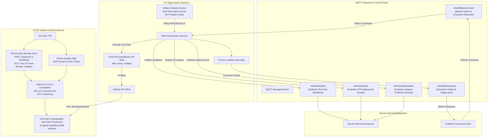

# NHIOT Pipeline: Autonomous Enterprise IoT DevSecOps & Zero-Downtime OTA Pipeline

An enterprise-grade, Over-The-Air (OTA) software delivery and process-isolated execution pipeline designed for IoT edge devices (such as Raspberry Pi `aarch64` and Linux `x86_64` smart gateways).

The pipeline combines automated multi-architecture cross-compilation, DevSecOps security analysis, cryptographic integrity verification, non-zero exit code process isolation protection, Pydantic-validated telemetry, and automated GitHub Actions build history rollback.

---

## Architecture Overview



---

## Enterprise MQTT Topic Mapping

| Topic | Direction | Payload Schema | Purpose |
| :--- | :--- | :--- | :--- |
| `nhiot/fleet/command` | Publisher $\rightarrow$ IoT Devices | `CommandPayload` | Admin commands (`add`, `minus`, `SET_BRANCH`, `TRIGGER_REVERT`) |
| `nhiot/fleet/response` | IoT Devices $\rightarrow$ Publisher | `CommandResponse` | Dynamic binary execution output (`stdout`, `stderr`) |
| `nhiot/ota/status` | IoT Devices $\rightarrow$ Server Audit | `OTAStatusPayload` | OTA Deployment status telemetry (`SUCCESS`, `ROLLBACK`, `FAILURE`) |
| `nhiot/heartbeat` | IoT Devices $\rightarrow$ Server Audit | `HeartbeatPayload` | Background 15-second fleet health pulse (`HEALTHY`) |
| `nhiot/isolation/status` | IoT Devices $\rightarrow$ Server Audit | `IsolationProtectionPayload` | Trapped non-zero returncode crash protection events (`PROTECTED`) |

---

## Environment Configuration & Required Secrets (`.env.example`)

Before executing the pipeline (locally or in containers), copy [.env.example](file:///home/amari/Desktop/NHIOTPipeline/.env.example) to `.env`:

```bash
cp .env.example .env
```

### Required Configuration & Secrets Specification

| Key / Variable | Category | Required / Optional | Description |
| :--- | :--- | :--- | :--- |
| `GITHUB_TOKEN` | GitHub API Secret | **Required** | Personal Access Token (PAT) with `repo` and `actions` scope used to query GitHub Actions API, download multi-arch build artifacts, and dispatch rollback workflows. |
| `OWNER` | GitHub Config | **Required** | GitHub repository owner / organization name (e.g., `Amari-Lawal`). |
| `REPO` | GitHub Config | **Required** | Target GitHub repository name (e.g., `NHIOTPipeline`). |
| `WORKFLOW_ID` | GitHub Config | **Required** | Workflow file name responsible for cross-compilation (`build.yml`). |
| `BRANCH` | Target Deployment | **Required** | Target git branch for OTA artifact fetching (default: `main`). |
| `POLL_INTERVAL` | Telemetry Config | **Required** | Artifact polling & telemetry interval in seconds (default: `10`). |
| `SUBSCRIBER_ARCHITECTURE` | Edge Architecture | **Required** | Target CPU architecture filter for ELF binary header verification (`x86_64` or `aarch64`). |
| `ARTIFACT_NAME` | Build Artifact | **Required** | Name prefix of the compiled executable artifact (default: `hello`). |
| `RPI_IP` | Secure Edge Credentials | Optional | Target IP address of the physical smart gateway / Raspberry Pi device (e.g., `192.168.1.11`). |
| `RPI_USERNAME` | Secure Edge Credentials | Optional | SSH username for remote edge device access (e.g., `amari`). |
| `RPI_PASSWORD` | Secure Edge Credentials | Optional | SSH password / key passphrase for secure remote execution. |
| `ENDPOINT` / `MQTT_BROKER` | MQTT Control Plane | **Required** | Hostname of the MQTT broker (local Docker hostname `mqtt-broker`, `localhost`, or AWS IoT endpoint). |
| `MQTT_PORT` | MQTT Control Plane | **Required** | Broker port (`1883` for unencrypted local, `18883` for Docker host-mapped, or `8883` for TLS). |
| `USE_LOCAL_BROKER` | MQTT Control Plane | **Required** | Set to `true` for local Mosquitto / Docker sandbox evaluation; `false` for AWS IoT Core TLS. |
| `CA_FILE` | TLS Certificates | Optional (AWS IoT) | Path to Root CA Certificate file (`root-CA.crt`). |
| `CERT_FILE` | TLS Certificates | Optional (AWS IoT) | Path to X.509 Device Certificate (`device.pem.crt`). |
| `PRIVATE_KEY_FILE` | TLS Certificates | Optional (AWS IoT) | Path to RSA/ECC Private Key file (`private.pem.key`). |

> [!IMPORTANT]
> **Secret Security & Leak Prevention**: Never commit raw `.env` files or `.pem` cryptographic keys to version control. The repository integrates **Gitleaks** in `.github/workflows/build.yml` to automatically block pull requests or pushes containing exposed API tokens or certificates.

---

## Execution & Quick-Start Guide

The pipeline supports two execution modes depending on your evaluation context:
1. **Mode 1: All-in-One Execution (Examiner / Fast Evaluation Mode)** — Launches all services concurrently using a single command or script.
2. **Mode 2: Separate Terminals Execution (Intended Real-World Architecture)** — Runs each daemon in its own terminal to mirror distributed IoT edge hardware and server nodes.

---

### Mode 1: All-in-One Execution (Examiner / Fast Evaluation Mode)

> [!NOTE]
> **Examiner Evaluation**: This mode is optimized for fast, single-step evaluation without requiring manual management of multiple terminal windows.

#### Option 1A: Docker Compose Sandbox (RECOMMENDED — Zero Port/OS Collisions)

Docker Compose orchestrates the entire ecosystem (MQTT Broker, Server Audit daemon, IoT Subscriber daemon, and Publisher suite) in a single containerized environment.

1. **Launch All Services in One Command**:
   ```bash
   docker compose up -d
   ```
   *(Or run `docker compose up` without `-d` to stream all daemon logs directly in your current terminal).*

2. **Watch Live Telemetry & Audit Logs**:
   ```bash
   docker compose logs -f server-audit
   ```

3. **Run Verification Commands**:
   In a separate terminal, trigger commands via the containerized publisher suite:
   ```bash
   # Test Dynamic Branch Switch (dev, main)
   docker compose exec publisher ./run_pub.sh dev

   # Trigger Process Isolation Protection & Trapped Crash Telemetry
   docker compose exec publisher ./run_pub.sh crash

   # Trigger Automated GitHub Actions Version History Rollback
   docker compose exec publisher ./run_pub.sh revert
   ```

4. **Tear Down**:
   ```bash
   docker compose down
   ```

#### Option 1B: Local All-in-One Script (`./run_all.sh`)

If running directly on the host machine, use the provided `run_all.sh` script to spawn all daemons in a single terminal session:

1. **Environment Setup**:
   ```bash
   python3 -m venv venv
   source venv/bin/activate
   pip install -r requirements.txt
   ```

2. **Run All Daemons in One Terminal**:
   ```bash
   ./run_all.sh
   ```
   *(Both Server Audit and IoT Subscriber daemons will start in the background within the terminal. Press `Ctrl+C` at any time to cleanly stop all services).*

3. **Run Verification Commands**:
   In a second terminal:
   ```bash
   source venv/bin/activate

   ./run_pub.sh dev
   ./run_pub.sh crash
   ./run_pub.sh revert
   ```

---

### Mode 2: Separate Terminals Execution (Intended Real-World Architecture)

> [!IMPORTANT]
> **Intended System Architecture**: In a real production deployment, each component operates on physically isolated infrastructure (e.g., IoT Edge device hardware nodes, Server Audit Cloud/On-Prem servers, and MQTT Message Broker clusters). Running in separate terminals mirrors this intended distributed architecture, allowing clear isolation and real-time per-daemon log inspection.

#### 1. Environment Setup
```bash
# Create and activate virtual environment
python3 -m venv venv
source venv/bin/activate

# Install required dependencies
pip install -r requirements.txt
```

#### 2. Launch Services across Dedicated Terminals

- **Terminal 1: Server Audit Daemon**
  *Simulates the centralized server monitoring fleet health, OTA status updates, and crash protection reports.*
  ```bash
  source venv/bin/activate
  ./run_sub_server.sh
  ```

- **Terminal 2: IoT Edge Device Subscriber Daemon**
  *Simulates the IoT Edge device daemon listening to MQTT topics, verifying binary signatures/ELF headers, and executing process-isolated binaries.*
  ```bash
  source venv/bin/activate
  ./run_sub_iot.sh
  ```

- **Terminal 3: Publisher & Admin Control Suite**
  *Simulates the administrative control plane issuing OTA deployment requests and health checks.*
  ```bash
  source venv/bin/activate

  # A. Dynamic Branch Switch (dev / main)
  ./run_pub.sh dev

  # B. Trigger Process Isolation Crash Protection
  ./run_pub.sh crash

  # C. Trigger Automated GitHub Actions Version History Rollback
  ./run_pub.sh revert
  ```

---

## Security Gates & Quality Controls

### 1. DevSecOps Security Pipeline (`.github/workflows/build.yml`)
- **SAST (Static Application Security Testing)**: `Cppcheck` detects memory leaks and uninitialized variables; `Flawfinder` scores risk levels for C source files.
- **SCA (Software Composition Analysis)**: `Trivy` scans repository dependencies and compiled executable binaries for known CVE vulnerabilities.
- **Secret Leak Prevention**: `Gitleaks` scans commits for exposed API keys and credentials.
- **GCC Security Hardening Flags**: Executables are compiled using `-O2 -Wall -Wextra -fstack-protector-strong -D_FORTIFY_SOURCE=2 -Wformat -Wformat-security`.
- **Python Quality Gate**: `Ruff` enforces code formatting (`line-length = 120`) and linting (`select = ["E", "F", "W", "I"]`).

### 2. Edge Device Integrity & Verification
- **SHA-256 Checksum Verification**: Downloaded binaries are compared against `.sha256` files generated during compilation.
- **ELF Header Architecture Check**: Reads the 64-byte ELF header using Python `struct` to verify magic bytes (`\x7fELF`), 64-bit class (`2`), and target architecture (`0x3E` for `x86_64`, `0xB7` for `aarch64`).
- **Post-Pull Operational Unit Test Suite**: Executes standard arithmetic tests (`add 10 20`, `minus 50 20`, `multiply 6 7`). If tests fail, the system automatically triggers a GitHub Actions version history revert.