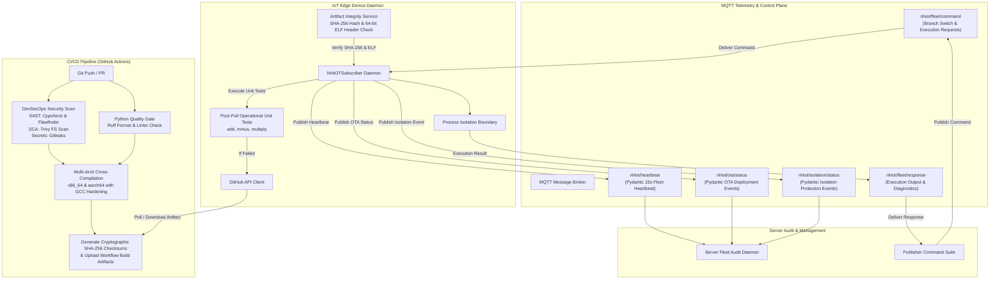

# NHIOT Pipeline: Autonomous Enterprise IoT DevSecOps & Zero-Downtime OTA Pipeline

An enterprise-grade, Over-The-Air (OTA) software delivery and process-isolated execution pipeline designed for IoT edge devices (such as Raspberry Pi `aarch64` and Linux `x86_64` smart gateways).

The pipeline combines automated multi-architecture cross-compilation, DevSecOps security analysis, cryptographic integrity verification, non-zero exit code process isolation protection, Pydantic-validated telemetry, and automated GitHub Actions build history rollback.

---

## Architecture Overview



---

## Enterprise MQTT Topic Mapping

| Topic | Direction | Payload Schema | Purpose |
| :--- | :--- | :--- | :--- |
| `nhiot/fleet/command` | Publisher $\rightarrow$ IoT Devices | `CommandPayload` | Admin commands (`add`, `minus`, `SET_BRANCH`, `TRIGGER_REVERT`) |
| `nhiot/fleet/response` | IoT Devices $\rightarrow$ Publisher | `CommandResponse` | Dynamic binary execution output (`stdout`, `stderr`) |
| `nhiot/ota/status` | IoT Devices $\rightarrow$ Server Audit | `OTAStatusPayload` | OTA Deployment status telemetry (`SUCCESS`, `ROLLBACK`, `FAILURE`) |
| `nhiot/heartbeat` | IoT Devices $\rightarrow$ Server Audit | `HeartbeatPayload` | Background 15-second fleet health pulse (`HEALTHY`) |
| `nhiot/isolation/status` | IoT Devices $\rightarrow$ Server Audit | `IsolationProtectionPayload` | Trapped non-zero returncode crash protection events (`PROTECTED`) |

---

## Step-by-Step Examiner Quick-Start Guide

Follow these simple instructions to run the entire pipeline end-to-end on your local machine.

### Prerequisites

- **Python**: 3.11 or higher
- **Operating System**: Linux (x86_64 or aarch64) or macOS / WSL

### 1. Environment Setup

Clone the repository and set up the Python virtual environment:

```bash
# 1. Create and activate virtual environment
python3 -m venv venv
source venv/bin/activate

# 2. Install required dependencies
pip install -r requirements.txt
```

---

### 2. Running the System (3 Terminal Setup)

Open **3 separate terminal windows** inside the project directory (`/path/to/NHIOTPipeline`).

#### Terminal 1: Launch Server Fleet Audit Daemon
The Server Audit Daemon listens for incoming fleet heartbeats, OTA deployment notifications, and process isolation protection events.

```bash
source venv/bin/activate
./run_sub_server.sh
```
*Output*: Displays active fleet count, 15-second heartbeat telemetry, OTA updates, and protection events in real-time.

#### Terminal 2: Launch IoT Device Subscriber Daemon
The IoT Subscriber daemon runs on the target edge device. It maintains a 15s background heartbeat, polls GitHub Actions for compiled artifacts, verifies SHA-256 checksums and 64-bit ELF headers, runs post-pull operational unit tests, and isolates binary execution.

```bash
source venv/bin/activate
./run_sub_iot.sh
```
*Output*: Loads the current operational binary, starts background heartbeat thread, and listens on `nhiot/fleet/command`.

#### Terminal 3: Publisher Control Suite & Test Verification
Use the publisher tool to issue commands, switch target environment branches, trigger failure isolation protection, and test automated GitHub Actions version history rollbacks.

---

### 3. Verification Commands for the Examiner

Run the following commands in **Terminal 3** while Terminals 1 and 2 are running:

#### A. Test Dynamic Branch Switch (`main`, `dev`, `staging`, `test`)
Request the IoT device to target a different branch environment, fetch its compiled GitHub artifact, run post-pull unit tests, and hot-swap binaries:

```bash
./run_pub.sh dev
```
*Result*: Terminal 2 downloads the `dev` branch artifact, verifies SHA-256 and ELF headers, runs post-pull unit tests (`add`, `minus`, `multiply`), and Terminal 1 receives an `OTAStatusPayload` with `status: SUCCESS`.

#### B. Trigger Process Isolation Protection & Trapped Crash Telemetry
Send a division-by-zero crash request to test process isolation protection:

```bash
./run_pub.sh crash
```
*Result*: 
1. The IoT device traps the non-zero exit code (`exit code -8` SIGFPE) within its isolated boundary without crashing the subscriber daemon.
2. Terminal 3 displays the trapped stderr error.
3. Terminal 1 logs an `IsolationProtectionPayload` event on `nhiot/isolation/status` showing `status: PROTECTED`.

#### C. Trigger Automated GitHub Actions Build History Rollback
Trigger a remote GitHub Actions version rollback:

```bash
./run_pub.sh revert
```
*Result*:
1. The IoT subscriber queries the GitHub Actions API for past completed successful workflow runs (`get_recent_successful_runs`).
2. It downloads the previous working build artifact (`run #N-1`), verifies checksums and ELF headers, and runs post-pull operational unit tests.
3. Once verified, it hot-swaps to the historical binary and sends an `OTAStatusPayload` with `status: ROLLBACK` to Terminal 1.

---

## Security Gates & Quality Controls

### 1. DevSecOps Security Pipeline (`.github/workflows/build.yml`)
- **SAST (Static Application Security Testing)**: `Cppcheck` detects memory leaks and uninitialized variables; `Flawfinder` scores risk levels for C source files.
- **SCA (Software Composition Analysis)**: `Trivy` scans repository dependencies and compiled executable binaries for known CVE vulnerabilities.
- **Secret Leak Prevention**: `Gitleaks` scans commits for exposed API keys and credentials.
- **GCC Security Hardening Flags**: Executables are compiled using `-O2 -Wall -Wextra -fstack-protector-strong -D_FORTIFY_SOURCE=2 -Wformat -Wformat-security`.
- **Python Quality Gate**: `Ruff` enforces code formatting (`line-length = 120`) and linting (`select = ["E", "F", "W", "I"]`).

### 2. Edge Device Integrity & Verification
- **SHA-256 Checksum Verification**: Downloaded binaries are compared against `.sha256` files generated during compilation.
- **ELF Header Architecture Check**: Reads the 64-byte ELF header using Python `struct` to verify magic bytes (`\x7fELF`), 64-bit class (`2`), and target architecture (`0x3E` for `x86_64`, `0xB7` for `aarch64`).
- **Post-Pull Operational Unit Test Suite**: Executes standard arithmetic tests (`add 10 20`, `minus 50 20`, `multiply 6 7`). If tests fail, the system automatically triggers a GitHub Actions version history revert.