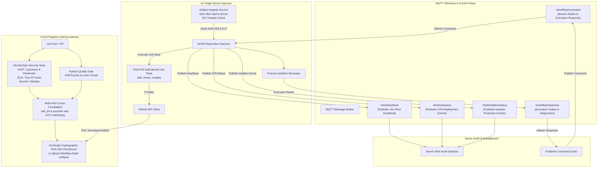

# NHIOT Pipeline: Autonomous Enterprise IoT DevSecOps & Zero-Downtime OTA Pipeline

An enterprise-grade, Over-The-Air (OTA) software delivery and process-isolated execution pipeline designed for IoT edge devices (such as Raspberry Pi `aarch64` and Linux `x86_64` smart gateways).

The pipeline combines automated multi-architecture cross-compilation, DevSecOps security analysis, cryptographic integrity verification, non-zero exit code process isolation protection, Pydantic-validated telemetry, and automated GitHub Actions build history rollback.

---

## Architecture Overview



---

## Enterprise MQTT Topic Mapping

| Topic | Direction | Payload Schema | Purpose |
| :--- | :--- | :--- | :--- |
| `nhiot/fleet/command` | Publisher $\rightarrow$ IoT Devices | `CommandPayload` | Admin commands (`add`, `minus`, `SET_BRANCH`, `TRIGGER_REVERT`) |
| `nhiot/fleet/response` | IoT Devices $\rightarrow$ Publisher | `CommandResponse` | Dynamic binary execution output (`stdout`, `stderr`) |
| `nhiot/ota/status` | IoT Devices $\rightarrow$ Server Audit | `OTAStatusPayload` | OTA Deployment status telemetry (`SUCCESS`, `ROLLBACK`, `FAILURE`) |
| `nhiot/heartbeat` | IoT Devices $\rightarrow$ Server Audit | `HeartbeatPayload` | Background 15-second fleet health pulse (`HEALTHY`) |
| `nhiot/isolation/status` | IoT Devices $\rightarrow$ Server Audit | `IsolationProtectionPayload` | Trapped non-zero returncode crash protection events (`PROTECTED`) |

---

## Step-by-Step Examiner Quick-Start Guide

You can evaluate the system using **Method A (Docker Compose - Recommended)** or **Method B (Local Shell Setup)**.

---

### Method A: Docker Compose Sandbox (RECOMMENDED — Zero Port/OS Collisions)

To ensure zero port collisions, dependency conflicts, or local system pollution, Docker Compose launches a self-contained MQTT broker, Server Audit daemon, IoT Subscriber daemon, and Publisher suite.

#### 1. Launch the System
```bash
docker compose up -d
```

#### 2. View Live Audit Telemetry Logs
```bash
# Watch live fleet heartbeats, OTA updates, and protection events:
docker compose logs -f server-audit
```

#### 3. Run Examiner Verification Commands
In another terminal, execute commands via the containerized publisher suite:

```bash
# A. Test Dynamic Branch Switch (dev, main)
docker compose exec publisher ./run_pub.sh dev

# B. Trigger Process Isolation Protection & Trapped Crash Telemetry
docker compose exec publisher ./run_pub.sh crash

# C. Trigger Automated GitHub Actions Version History Rollback
docker compose exec publisher ./run_pub.sh revert
```

#### 4. Tear Down
```bash
docker compose down
```

---

### Method B: Local Shell Setup

If you prefer running directly on your host operating system:

#### 1. Environment Setup
```bash
# Create and activate virtual environment
python3 -m venv venv
source venv/bin/activate

# Install required dependencies
pip install -r requirements.txt
```

#### 2. Launch Services (3 Terminal Setup)

- **Terminal 1 (Server Audit Daemon)**:
  ```bash
  source venv/bin/activate
  ./run_sub_server.sh
  ```
- **Terminal 2 (IoT Device Subscriber Daemon)**:
  ```bash
  source venv/bin/activate
  ./run_sub_iot.sh
  ```
- **Terminal 3 (Publisher Verification Commands)**:
  ```bash
  source venv/bin/activate

  # A. Dynamic Branch Switch
  ./run_pub.sh dev

  # B. Trigger Crash Protection
  ./run_pub.sh crash

  # C. Trigger GitHub Actions History Rollback
  ./run_pub.sh revert
  ```

---

## Security Gates & Quality Controls

### 1. DevSecOps Security Pipeline (`.github/workflows/build.yml`)
- **SAST (Static Application Security Testing)**: `Cppcheck` detects memory leaks and uninitialized variables; `Flawfinder` scores risk levels for C source files.
- **SCA (Software Composition Analysis)**: `Trivy` scans repository dependencies and compiled executable binaries for known CVE vulnerabilities.
- **Secret Leak Prevention**: `Gitleaks` scans commits for exposed API keys and credentials.
- **GCC Security Hardening Flags**: Executables are compiled using `-O2 -Wall -Wextra -fstack-protector-strong -D_FORTIFY_SOURCE=2 -Wformat -Wformat-security`.
- **Python Quality Gate**: `Ruff` enforces code formatting (`line-length = 120`) and linting (`select = ["E", "F", "W", "I"]`).

### 2. Edge Device Integrity & Verification
- **SHA-256 Checksum Verification**: Downloaded binaries are compared against `.sha256` files generated during compilation.
- **ELF Header Architecture Check**: Reads the 64-byte ELF header using Python `struct` to verify magic bytes (`\x7fELF`), 64-bit class (`2`), and target architecture (`0x3E` for `x86_64`, `0xB7` for `aarch64`).
- **Post-Pull Operational Unit Test Suite**: Executes standard arithmetic tests (`add 10 20`, `minus 50 20`, `multiply 6 7`). If tests fail, the system automatically triggers a GitHub Actions version history revert.