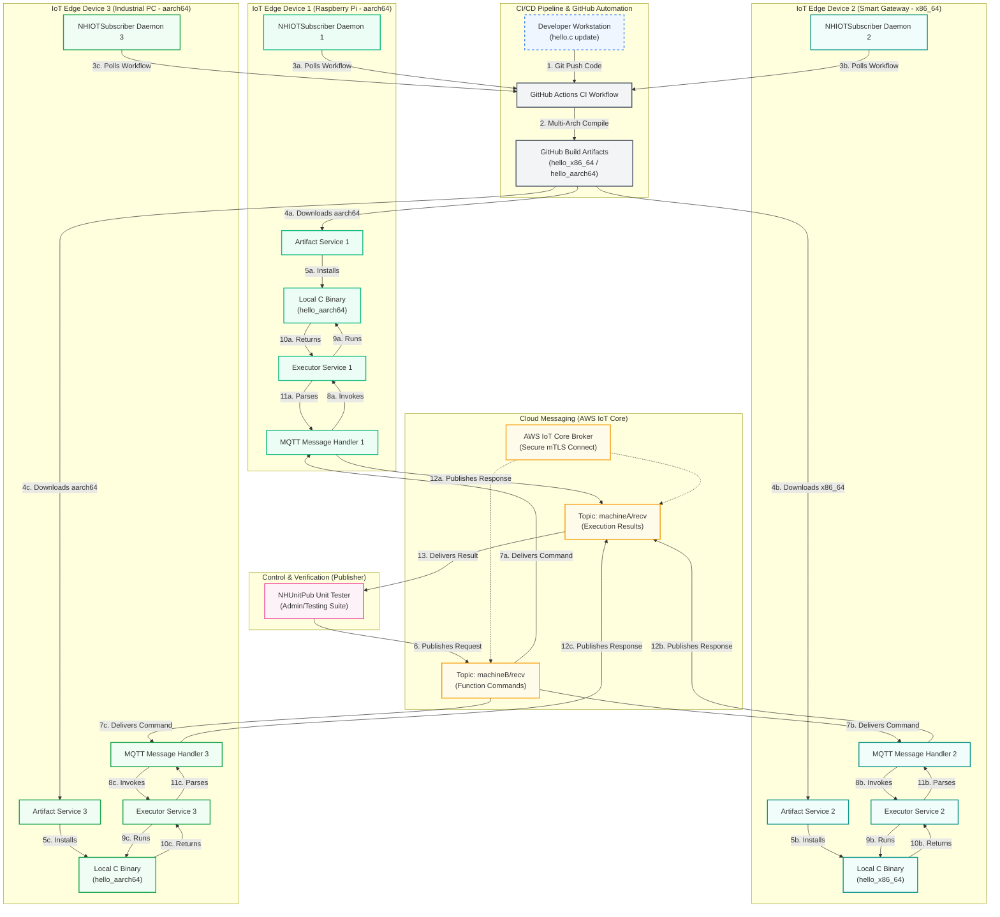

# NHIOT Pipeline
To start in on terminal run the subscriber which would be the Raspberry Pi or IOT. Make sure that in Github actions the correct aarch/x86_64 compiler is installed.
```
./run_sub.py
```
Then first build the artifact with this will build the artifact, in the NHSub window it should say "Downloading artifact 'hello_x86'...":
```
./build_artifact.sh
```

Then run the publisher which will be the main device. This would be the admin that wants to test the executable from a distance with unittests.
```
./run_pub.sh
```

When creating a function to test in the C artefact ensure that it prints out to the stdout using:
```
printf("add:%d", count);
```
For error handling to send an error to the publisher use:
```
fprintf(stderr, "add: no arguments provided\n");
```
Ensure that  the string is in the format of:
```
printf("<function_name>:<result>", count);

```
and
```
fprintf(stderr, "<function_name>:<error_message>");

```
## Limitations 
So far two out of three architectures have been developed for:
1. Desktop x86_64 
2. Embedded Linux - Raspbery Pi and ARM devices.
3. MicroControllers - Can be done but requires refactor from python to C.
Libraries Needed for Microcontrollers
1. awscrt Python -> AWS CRT (C Libraries)
2. awsiot (Python SDK v2) -> AWS IoT Embedded C SDK
3. requests (Python) -> C Equivalent.


## System Architecture
An end-to-end, Over-the-Air (OTA) update and execution system designed for IoT edge nodes. It integrates automated cross-compilation pipelines, secure cloud messaging via AWS IoT Core, and distributed executable unit testing on target hardware architectures (e.g., Raspberry Pi, ARM, and Desktop Linux).

### Architecture Diagram



### Component Details

1. **CI/CD Pipeline (GitHub Actions)**:
   - Compiles C executable code targeting multiple architectures (`x86_64` and `aarch64`) dynamically on commit to the `main` branch.
   - Uploads compiled platform-specific executables as workflow build artifacts.
2. **OTA Update Subscriber (Edge Daemon)**:
   - Polling daemon running locally on the edge device that tracks GitHub workflow statuses.
   - Automatically downloads, verifies, and launches newly compiled binaries dynamically upon successful completion of a remote build.
3. **AWS IoT Core Message Broker**:
   - Manages secure, bidirectional communication between the central controller and the edge devices using MQTT over mutual TLS (mTLS) authentication.
4. **Edge Execution Subprocess**:
   - Spawns the native C binary securely, executing request-driven business logic (`add`, `minus`, `multiply`) and formatting results (`stdout` and `stderr`) into a unified JSON format validated by **Pydantic**.
5. **Publisher Controller**:
   - Remote client triggering test execution, injecting payloads containing targeting functions and variables, and asserting the output from the edge device.


# TODO 
1. Determine testing metrics like *Mean Time To Repair (MTTR)* and Mean Time Between Failures (MTBF).
2. Make automated tests and analytics data points for metric making sure it aligns with the brief specifcation.
3. Make or choose a more complex functions in the artifact and parameters and use them for metrics and datapoints
#  TODO Meh
1. Automate AWSMqtt Authentication and Policy creation process.
Here you go, Amari — clear, concrete, numerically measurable testing, analysis, and evaluation methods you can use in your Results & Analysis and Critical Evaluation chapters. These will map cleanly to your OTA-update IoT pipeline project and help you produce strong, evidence‑based results.

I’ll give you:

SMART metrics you can measure
Testing and analysis methods you can apply
How to present numeric results
Critical evaluation angles
✅ 1. SMART Numerical Metrics You Can Use
System Performance Metrics
Goal
SMART Version
Example Measurement
Reduce manual update time
Reduce average manual update time from X minutes to under Y minutes per update by May 2025
Time benchmarks before & after solution
Increase update success rate
Achieve ≥ 98% OTA update success rate across N test runs by final demo week
Pass/fail logs
Reduce device downtime
Reduce device downtime during update from legacy average (e.g., 2 min) to ≤ 10 seconds by project completion
Measured via device heartbeat logs
Quality & Reliability Metrics
Goal
SMART Version
Measurement Method
Improve software reliability
Ensure ≥ 90% unit test coverage of update-related functions using automated GitHub Actions before submission
Coverage report
Detect update-related defects earlier
Achieve 100% automated test execution for every commit by integrating CI pipeline
GitHub Actions logs
Reduce update-caused failures
Target 0 critical failures and ≤ 2 minor fails across 30 OTA update test cycles
Error logs and device telemetry
Network & Deployment Metrics
Goal
SMART Version
Measurement Method
Measure dead-zone resilience
Ensure device reconnects and resumes update within ≤ 5 seconds after a forced signal drop
Network simulation tests
Measure update package size efficiency
Compress update bundles to ≤ X MB to meet bandwidth constraints
File size logs
✅ 2. Methods You Can Use to Analyse Your Results
Below are specific, academically acceptable methods tied to your project.

A. Quantitative System Testing (Core for Your Project)
1. Automated CI/CD Test Results (Unit Test Analytics)
You already automated unit tests — now analyse:

Number of test cases run
Number of tests passed/failed
Coverage percentage
Trends across commits (e.g., decreasing failures)
How to display:
Line charts, bar charts, coverage heatmaps, failure rate percentages.

2. OTA Update Time Benchmarks
Run repeated update cycles (e.g., 30 runs) and record:

Start → finish time
Verification time
Device reboot time
Downtime intervals
How to analyse:

Mean, median, standard deviation
Box-plot to show variation
Compare with manual update baseline
3. Failure Rate & Reliability Testing
For each OTA update iteration:

Did it succeed?
If failed, what stage?
Error type classification
Compute:

MTBF — Mean Time Between Failures
Failure Rate %
Recovery time
This is gold for an engineering-style report.

4. Network Interruption Testing
Simulate:

Weak signal
Total drop
Packet loss
Partial update failure
Measure:

Recovery time
Partial update handling
Package integrity checks success
Use bar graphs to show % recoveries under different conditions.

B. Comparative Evaluation
Compare:

Legacy Manual Process vs Your Automated Pipeline
Criterion
Manual
Automated
Improvement
Time to update
e.g., 20 mins
2 mins
90% faster
Human resource cost
1 contractor
0
100% reduction
Device downtime
2 mins
10 sec
92% reduction
Success rate
85%
98%
+13%
Error detection
None
Unit tests + CI
Major benefit
Graphs + tables = strong marks.

C. Risk Analysis (Quantitative)
Measure risk severity before and after automation.
Use a Risk Matrix with numerical scoring:

Likelihood (1–5)
Impact (1–5)
Risk = L × I
Example:

Risk
Before
After
Update failure
20
5
Downtime
15
3
Contractor dependency
25
0
This gives compelling numerical evidence.

D. Ethical & Data Protection Considerations
Focus on:

No live ANPR or personal data used
Only synthetic or stubbed telemetry
GDPR compliance
Secure handling of device logs
Controlled test environment
This is required for marks.

✅ 3. How to Display Your Analysis in Your Report
Use clean, measurable displays:

Graphs
OTA update time comparison (bar chart)
Test coverage increase over time (line graph)
Failure rate under different network conditions (bar or pie chart)
Tables
SMART objective progress
Comparison of manual vs automated processes
Error type frequency distribution
Diagrams
Workflow of OTA pipeline
Sequence diagram of update process
Statistical Methods
Averages
Standard deviation
Confidence intervals
Boxplots for variability
✅ 4. Critical Evaluation of Results (What You Can Say)
This answers the “So what?” part of your brief.

Discuss:

What worked well
Significant reduction in time and human labour
CI/CD enforcing higher code quality
Reliable automated recovery mechanisms
Near-zero downtime prototype performance
What didn’t work or needs improvement
Limited real-world device diversity
Only tested under controlled network simulations
Hardware constraints of the legacy IoT device
No integration with National Highways real backend systems
Impact on operational area
Removes need for field engineer dispatch
Cuts maintenance cost per camera
Reduces road network downtime
Scales across thousands of devices
Supports safer, more reliable roadside systems
Remaining Questions (your brief requires this!)
How would this scale to millions of deployed devices?
Can the OTA system handle security updates for critical systems?
How does this integrate with National Highways’ central platform?
What regulatory approvals would be required?
These questions show "room for future research," which the brief expects.

✅ Want me to create your Results & Analysis chapter or Critical Evaluation chapter?
I can write them in academic style, properly structured, and tailored to your exact project.
Just say “write my Results & Analysis chapter” or “write my Critical Evaluation section”.


Test