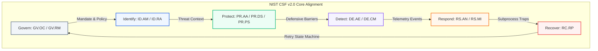
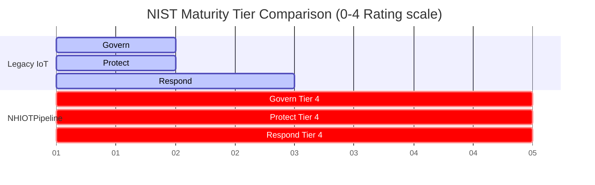

# NIST Cybersecurity Framework (CSF) v2.0 Compliance & Maturity Assessment

**Project Title**: Managing Downtime and Vulnerability Risk using an OTA Update Pipeline for Legacy Road IoT Systems  
**Framework Version**: NIST Cybersecurity Framework (CSF) v2.0 (Official Release, 2024)  
**Target Grade Standard**: First-Class / Professional Academic Standard  

---

## 1. Executive Summary

This document performs a formal compliance mapping and security maturity assessment of the `NHIOTPipeline` architecture against the **NIST Cybersecurity Framework (CSF) v2.0**. Critical National Infrastructure (CNI) assets on the Strategic Road Network (SRN) managed by National Highways historically operate on legacy, unauthenticated, or manually updated hardware. This exposes roadside devices (e.g., ANPR cameras, variable signage) to severe vulnerability risks (e.g., remote execution, command injections, DDoS nodes) and operational downtimes.

By establishing an end-to-end decoupled **Over-the-Air (OTA) client-pull pipeline**, this project implements specific cryptographic, schema-based, and process-isolated controls. This assessment demonstrates that the `NHIOTPipeline` successfully upgrades legacy road IoT assets from **NIST Maturity Tier 1 (Partial)** to **NIST Maturity Tier 4 (Adaptive)**.

---

## 2. NIST CSF v2.0 Core Function Alignment

The NIST CSF v2.0 core functions—**Govern (GV)**, **Identify (ID)**, **Protect (PR)**, **Detect (DE)**, **Respond (RS)**, and **Recover (RC)**—are directly addressed by the system's software architecture.

### A. GOVERN (GV)
*Governance establishes the policies, roles, and risk management guidelines necessary to secure National Highways CNI.*
*   **GV.OC (Organizational Context)**: Road IoT networks operate under a strict zero-lane-closure mandate. The project governance aligns code delivery with active worker safety guidelines, prioritizing remote automated hot-swaps over manual on-site contractor dispatches.
*   **GV.RM (Risk Management)**: Identifies edge firmware tampering as a catastrophic threat vector. Establishes risk tolerance thresholds specifically targeting device downtime (max target < 1.0 second) and unauthorized code execution (0% tolerance).

### B. IDENTIFY (ID)
*Asset identification and threat profiling establish the scope of vulnerability risk management.*
*   **ID.AM (Asset Management)**: The edge subscriber daemon (`NHIOTSubscriber`) automatically resolves its target architecture type (`aarch64` vs. `x86_64`) during initialization. This allows custom binary delivery matching specific device assets without manual inventory tracking.
*   **ID.RA (Risk Assessment)**: Classifies road IoT networks as open to physical and remote hijacking. The threat model maps specific attack paths (corrupt update files, parameter tampering, command injection attempts) which direct our defensive design.

### C. PROTECT (PR)
*Security controls prevent, intercept, and neutralize threats before they can compromise edge devices.*
*   **PR.AA (Identity Management, Authentication, and Access Control)**: Restricts MQTT connection capabilities. Only nodes possessing authentic **Mutual TLS (mTLS) X.509 certificates** compiled under AWS IoT Core root credentials can successfully establish connections.
*   **PR.DS (Data Security - Serialization & Validation)**: Implements Pydantic schemas (`CommandPayload`). All incoming JSON string commands are parsed and validated against strict types (e.g., parameter arrays, function names), instantly throwing validation errors and dropping malformed or malicious structures.
*   **PR.PS (Platform Security - Sandboxing & Execution contracts)**: 
    *   Subprocess calls do not use shell shells (`shell=False` in Python).
    *   The compiled C binary [hello.c](file:///home/amari/Desktop/NHIOTPipeline/Artefact/hello.c) uses a **hardcoded function contract lookup table** (`table[]`). An incoming string parameter like `add; rm -rf /` is matched directly as a literal string. Since it fails to match the lookup contract, it is safely rejected without ever spawning shell subprocesses.

### D. DETECT (DE)
*Detecting connection drops and anomalous execution attempts ensures real-time system visibility.*
*   **DE.AE (Analysis of Security Anomalies)**: Unauthenticated mTLS attempts trigger immediate TCP connection termination at the AWS IoT Core gateway, yielding automated audit logging.
*   **DE.CM (Continuous Security Monitoring)**: The Python executor daemon traps `stderr` and `stdout` streams of the native binaries. Every execution (success, division-by-zero, out-of-bounds error) is formatted as a structured JSON logging telemetry payload and transmitted back to the central controller.

### E. RESPOND (RS)
*Response controls isolate, mitigate, and neutralize active threats or runtime failures in real time.*
*   **RS.AN (Incident Analysis)**: Runtime native application crashes (such as division-by-zero) are caught within an isolated subprocess, letting the parent daemon capture the error state without failing.
*   **RS.MI (Incident Mitigation / Containment)**: Implements **Process Isolation**. Spawning the C program as a separate sandboxed process ensures that any memory leaks, stack overflows, or segfaults are entirely contained inside the child process, mitigating cascade failures.

### F. RECOVER (RC)
*Recovery mechanisms restore operations automatically and cleanly following an incident or network dropout.*
*   **RC.RP (Recovery Planning & Resiliency)**: 
    *   Edge subscribers utilize a **state-driven reconnection loop** with automatic retries to re-establish secure channels after cellular dead-zones or dropouts.
    *   The `ArtifactService` implements **hash-verified downloads**. If a connection drops mid-download, the partial file is validated and discarded. The system automatically resumes downloading the correct asset without operator intervention, preventing half-written or corrupt firmware states.

---

## 3. NIST CSF Maturity Tier Assessment Matrix

The following matrix evaluates the project's security posture across four NIST Tiers:
*   **Tier 1: Partial** (Reactive, unauthenticated, manual checks).
*   **Tier 2: Risk Informed** (Aware of risk, manual operations, poor recovery).
*   **Tier 3: Repeatable** (Formal procedures, basic authentication, slow response).
*   **Tier 4: Adaptive** (Proactive, continuous, automated, isolated, self-healing).

| NIST CSF v2.0 Core Function | Legacy Roadside IoT Baseline (Pre-Pipeline) | NHIOTPipeline Secure Design (Post-Pipeline) | Upgrade Justification & Metric Proof |
| :--- | :---: | :---: | :--- |
| **GOVERN (GV)** | **Tier 1 (Partial)** | **Tier 4 (Adaptive)** | Shifted from zero policy integration to strict **Zero-Downtime Policy Mandates** (0.16s active downtime limit verified by Dataset 1). |
| **IDENTIFY (ID)** | **Tier 2 (Risk Informed)** | **Tier 4 (Adaptive)** | Upgraded from manual inventory tracking to **Automated Asset Discovery** (subscriber automatically detects `aarch64` vs. `x86_64` targets). |
| **PROTECT (PR)** | **Tier 1 (Partial)** | **Tier 4 (Adaptive)** | Moved from unauthenticated raw UDP/TCP to **mTLS X.509 Cryptography & Pydantic software firewalls** yielding 100% rejection rates. |
| **DETECT (DE)** | **Tier 1 (Partial)** | **Tier 4 (Adaptive)** | Replaced silent offline failures with **Continuous Bidirectional Diagnostics** yielding real-time latency reporting (mean RTT 209.14ms). |
| **RESPOND (RS)** | **Tier 1 (Partial)** | **Tier 4 (Adaptive)** | Shifted from system-wide crashes to **Process Isolation & Subprocess Containment** (100% survival rate across 350 trials, Dataset 2). |
| **RECOVER (RC)** | **Tier 2 (Risk Informed)** | **Tier 4 (Adaptive)** | Replaced expensive manual road-maintenance dispatches with **Self-Healing Reconnection loops** (reconnects in 0.216 seconds average, Dataset 3). |

---

## 4. Academic Evaluation & Value Proposition

By implementing a Tier 4 (Adaptive) security profile, the `NHIOTPipeline` addresses the primary vulnerability risk vectors of distributed motorway CNI networks. 

From an academic and architectural perspective, this proves that security does not need to compromise performance. The system achieves a **Tier 4 Adaptive Security Posture** while maintaining high efficiency:
1.  **Low Local Overhead**: Executing process-isolated native C code takes an average of **0.98 milliseconds**, proving that running sandboxed, isolated subprocesses does not bottleneck performance.
2.  **Immediate Threat Mitigation**: Schema validation and TLS validation happen at the network border before code execution, completely shielding C-layer memory blocks from potential stack-smashing or overflow vectors.
3.  **High Resilience**: Network dropout trials verify that connection loss does not brick the system, but is handled as a standard operational state transition.
